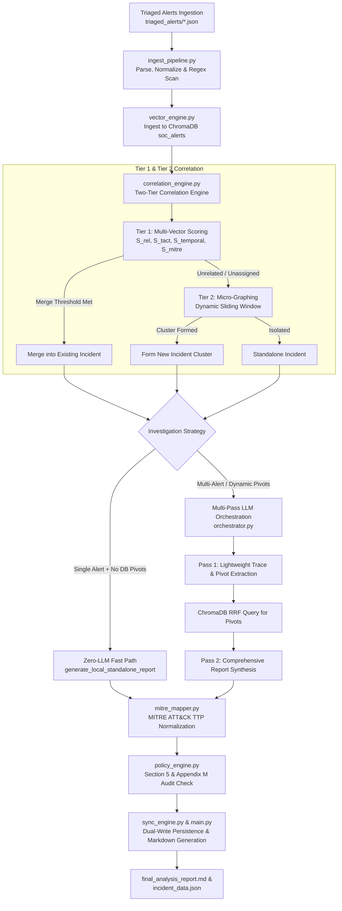

# Comprehensive Code & Architecture Documentation: SOC Investigation Agent (`integrated 4`)

---

## 1. Executive Summary & Architecture Overview

The **Investigation Agent** in the `integrated 4` environment (`c:\C300 FYPIntegrated-4\soc_investigation_agent_revised`) is an autonomous, hybrid AI/heuristic SOC Incident Response system. It takes pre-triaged alerts routed from the Triage Agent (specifically alerts classified as `Critical`, `High`, or `Medium`), performs two-tier incident correlation, executes interactive investigation playbooks, queries vector search databases for dynamic indicators, maps attack chains to MITRE ATT&CK TTPs, enforces enterprise cybersecurity compliance policies, and generates structured incident reports.

### High-Level Architectural Flow

---

## 2. Core Package Breakdown (`soc_investigation_agent_revised/`)

The primary implementation of the revised investigation agent lives in the `soc_investigation_agent_revised/` directory.

---

### 2.1 `main.py` — Pipeline Entry Point & Execution Orchestration
- **File Location:** [`soc_investigation_agent_revised/main.py`](file:///c:/C300%20FYPIntegrated-4/soc_investigation_agent_revised/main.py)
- **Primary Function:** Serves as the CLI entry point (`main()`) and asynchronous pipeline coordinator (`main_async()`).

#### Key Functions & Responsibilities:
1. **`main_async()`**:
   - Scans `triaged_alerts/` for unread alert JSON files.
   - Triggers `ingest_pipeline.process_log_file()` for bulk ingestion into ChromaDB (`vector_engine.ingest_logs()`).
   - Instantiates the `CorrelationEngine` and drains the queue sequentially.
   - Executes Phase 1 fast alert grouping (Tier 1 & Tier 2 correlation).
   - Executes Phase 2 parallel report generation using `asyncio.gather()`.
   - Manages state persistence and writes final outputs to `incident_reports/Incident-XXX/`.
2. **`select_playbook_automatically(seed_file_path)`**:
   - Auto-selects the appropriate YAML playbook based on alert metadata.
   - Maps email/phishing alerts to `playbooks/phishing.yaml`.
   - Defaults host/endpoint alerts (lateral movement, C2, privilege escalation, ransomware) to `playbooks/privilegeEscalation.yaml`.
3. **`generate_local_standalone_report(alert, playbook_path, inst_id)`**:
   - **Zero-LLM Fast Path:** Generates deterministic, highly specific incident reports for isolated single alerts that have no database cross-references, bypassing LLM API calls for performance.
4. **`write_markdown_report(dest_folder, incident_num_id, report)`**:
   - Writes the final formatted markdown report (`final_analysis_report.md`) containing severity, confidence, workflow actions, technical chronology, MITRE ATT&CK table, playbook trace table, recommended containment, and Appendix M compliance audit log table.

---

### 2.2 `orchestrator.py` — Multi-Pass Analysis & LLM Orchestration
- **File Location:** [`soc_investigation_agent_revised/orchestrator.py`](file:///c:/C300%20FYPIntegrated-4/soc_investigation_agent_revised/orchestrator.py)
- **Primary Function:** Implements structured LLM calls through OpenAI, micro-tasks, multi-pass playbook evaluation, and policy integration.

#### Key Pydantic Models & Data Schemas:
- **`MilestoneExecution`**: Standardized schema for playbook step execution (`step_id`, `instruction`, `status`: MET/NOT_MET/SKIPPED, `findings`).
- **`BusinessImpactChecklist`**: Appendix C evaluation (`critical_system`, `essential_service`, `data_sensitivity`, `operational_impact`).
- **`FinalIncidentAnalysis`**: Complete output schema (`incident_id`, `severity`, `confidence`, `execution_trace`, `incident_summary`, `actions_taken`, `recommended_containment`, `business_impact_checklist`, `severity_justification`, `confidence_justification`, `mitre_mappings`, `mitre_attack_table`, `policy_audit_logs`).
- **`Pass1Result`**: Lightweight schema returning `execution_trace` and extracted `suggested_pivots`.

#### Key Functions & Logic Flow:
1. **`analyze_alert_group_p1(correlated_alerts, playbook_path)` (Pass 1)**:
   - Evaluates the alert timeline against the playbook in a single lightweight LLM call.
   - Extracts concrete indicators (`suggested_pivots`) needed to satisfy unmet playbook steps.
2. **Dynamic Indicator Query**:
   - Queries ChromaDB using RRF search (`vector_engine.correlate_rrf()`) for extracted pivots to retrieve correlated historical alerts.
3. **`compile_final_report(correlated_alerts, playbook_path, p1_trace)` (Pass 2)**:
   - Synthesizes the enriched timeline, re-checks playbook milestones, queries policy vector index for relevant rules, runs `policy_engine.run_policy_compliance_rules()`, and generates the complete `FinalIncidentAnalysis`.
4. **Micro-Tasks**:
   - **`filter_suspicious_seeds(raw_tokens)`**: LLM micro-task to strip benign infrastructure noise (e.g. `127.0.0.1`, `svchost.exe`).
   - **`check_milestone_sufficiency(timeline_str, instruction, step_id)`**: Micro-task validating individual playbook step requirements.
   - **`classify_policies_for_investigation(sections)`**: One-time LLM parser classifying policy sections relevant to investigation.

---

### 2.3 `correlation_engine.py` — Two-Tier Alert Correlation Engine
- **File Location:** [`soc_investigation_agent_revised/correlation_engine.py`](file:///c:/C300%20FYPIntegrated-4/soc_investigation_agent_revised/correlation_engine.py)
- **Primary Function:** Implements mathematical two-tier alert correlation to merge related alerts into incidents or cluster orphan alerts into new incidents.

#### Tier 1: Multi-Vector Correlation (`evaluate_tier1`)
Ranks incoming alerts against active ongoing incidents using four scoring vectors:
1. **Relational Infrastructure Score ($S_{\text{rel}}$)**:
   - Computes physical asset overlap: exact IP or Host match ($1.0$), Username match ($0.6$), Subnet match ($0.2$).
2. **Tactical & Contextual Score ($S_{\text{tact}}$)**:
   - Weighted combination of Semantic Similarity (Cosine Similarity), MITRE ATT&CK Tactic Progression ($S_{\text{mitre}}$), Temporal Decay & Rhythm ($S_{\text{temporal}}$), and RRF Rank ($S_{\text{rrf}}$).
3. **Combined Score ($S_{\text{corr}}$)**:
   $$S_{\text{corr}} = \omega \cdot S_{\text{rel}} + (1 - \omega) \cdot S_{\text{tact}} - \Lambda_{\text{no\_cross}}$$
   - If $S_{\text{corr}} \ge \Theta_{\text{MATCH}} (0.65)$, the alert is merged into the existing incident (`MERGE`).
   - If $S_{\text{tact}} \ge \Theta_{\text{TACT\_HIGH}} (0.70)$ but $S_{\text{rel}} = 0$, it is tagged as `SIMILAR_BUT_UNRELATED` and routed to Tier 2.

#### Tier 2: Micro-Graphing & Dynamic Clustering (`evaluate_tier2`)
For orphan or unassigned alerts:
1. **Sliding Time Window**: Dynamically expands from 15 minutes (`INITIAL_WINDOW_SEC`) up to 2 hours (`MAX_WINDOW_SEC`).
2. **Graph Edge Construction (`_should_bridge_alerts`)**:
   - Bridges alerts if asset overlap exists within the time window OR if sequential MITRE ATT&CK tactics occur within 30 minutes on shared asset boundaries.
3. **Connected Components**: Extracts graph components into `NEW_CLUSTER` (if cluster size $\ge 2$) or `STANDALONE`.

---

### 2.4 `vector_engine.py` — Vector Database & RRF Search
- **File Location:** [`soc_investigation_agent_revised/vector_engine.py`](file:///c:/C300%20FYPIntegrated-4/soc_investigation_agent_revised/vector_engine.py)
- **Primary Function:** Integrates ChromaDB for log embedding storage (`soc_alerts` collection) using OpenAI `text-embedding-3-small` and performs Reciprocal Rank Fusion (RRF) retrieval.

#### Key Functions:
1. **`ingest_logs(logs_list)`**: Upserts processed log documents and metadata dictionaries into ChromaDB.
2. **`query_semantic(query_text, timestamp_epoch, time_window_sec)`**: Performs cosine vector search filtered by numeric epoch timestamps.
3. **`has_technical_token_overlap(candidate_meta, active_seeds)`**:
   - **Critical Guardrail:** Validates candidate alerts against active search seeds (IPs, subnets, domains, hashes, usernames, hostnames) to eliminate false semantic matches before RRF ranking.
4. **`correlate_rrf(active_indicators, query_text, timestamp_epoch, time_window_sec, k=60)`**:
   - Fuses semantic similarity ranks and exact metadata match ranks using standard RRF formula:
     $$\text{RRF Score} = \sum \frac{1}{k + r_{\text{semantic}}} + \sum \frac{1}{k + r_{\text{metadata}}}$$

---

### 2.5 `sync_engine.py` — State Synchronization & Dual-Write Persistence
- **File Location:** [`soc_investigation_agent_revised/sync_engine.py`](file:///c:/C300%20FYPIntegrated-4/soc_investigation_agent_revised/sync_engine.py)
- **Primary Function:** Implements transactional repositories, write-through dual-write synchronization (`IncidentSyncManager`), and a background directory file-watcher service (`RealtimeSyncService`).

#### Core Classes & Responsibilities:
- **`Incident` & `IncidentMetadata`**: Core Pydantic data models for incidents (`id`, `severity`, `status`, `raw_alerts`, `summary_text`, `indicators`).
- **`FileIncidentRepository`**: Implements transactional file-based storage (`incident_reports/Incident-XXX/incident_data.json`) with `begin()`, `save()`, `delete()`, `commit()`, and `rollback()`.
- **`SQLiteIncidentRepository`**: Alternative SQLite backend (`soc_incidents.db`) demonstrating ACID compliance.
- **`ChromaIncidentVectorStore`**: Vector store interface for incident summaries (`soc_incidents` collection).
- **`IncidentSyncManager`**: Two-phase transaction manager that coordinates writes between relational store and vector index, handling automatic rollbacks and vector compensation deletes if errors occur.
- **`RealtimeSyncService`**: Asynchronous file-watcher service that monitors `incident_reports/` for changes and syncs modified `incident_data.json` files to ChromaDB.

---

### 2.6 `mitre_mapper.py` — MITRE ATT&CK TTP Normalization & Mapping
- **File Location:** [`soc_investigation_agent_revised/mitre_mapper.py`](file:///c:/C300%20FYPIntegrated-4/soc_investigation_agent_revised/mitre_mapper.py)
- **Primary Function:** Maps incident event timelines into standardized MITRE ATT&CK TTPs (including sub-techniques like `T1566.002`, `T1569.002`, `T1021.002`) and renders markdown summary tables.

#### Key Functions:
1. **`normalize_incident_input(incident_input)`**: Normalizes diverse inputs (Pydantic objects, dicts, event lists) into chronological `TimelineEvent` objects.
2. **`map_incident_mitre_ttps(incident_input, llm)`**: Invokes LLM with structured output (`IncidentMitreAnalysis`) or falls back to `fallback_heuristic_mapper()`.
3. **`generate_markdown_table(analysis)`**: Formats the TTP mapping list into a markdown table with columns: `Timeline Phase / Activity`, `Observed Evidence`, `MITRE Tactic`, `MITRE Technique Name`, `MITRE ID`.

---

### 2.7 `policy_engine.py` — Policy Compliance Manager & Audit Generator
- **File Location:** [`soc_investigation_agent_revised/policy_engine.py`](file:///c:/C300%20FYPIntegrated-4/soc_investigation_agent_revised/policy_engine.py)
- **Primary Function:** Parses enterprise cybersecurity policies (`policies/soc_policies.md`), evaluates containment actions against corporate guidelines, enforces human analyst escalation rules, and records Appendix M policy audit logs.

#### Key Functions:
1. **`PolicyManager`**: Loads and parses `policies/soc_policies.md` by headers and appendices (Appendix A: Severity, Appendix B: Data Sensitivity, Appendix C: Business Impact, Appendix F: Confidence, Appendix G: Escalation, Appendix H: Ransomware, Appendix I: VM Compromise).
2. **`run_policy_compliance_rules(...)`**:
   - Evaluates incident findings against policy rules.
   - Automatically inserts mandatory containment rules for suspected Ransomware (Appendix H) or Virtual Guest OS compromise (Appendix I).
   - Evaluates decision points:
     - **DP-07**: Business Impact Assessment (Appendix C)
     - **DP-08**: Severity Classification (Appendix A)
     - **DP-09**: Confidence Scoring (Appendix F)
     - **DP-10 / DP-11**: Containment Approval & Analyst Escalation (Appendix G)
     - **DP-15**: Data Leakage Check (Appendix B)
   - Returns policy audit records (`PolicyAuditRecord`) for inclusion in Appendix M of the final report.

---

### 2.8 `ingest_pipeline.py` — Log Parsing & Regex Indicator Extraction
- **File Location:** [`soc_investigation_agent_revised/ingest_pipeline.py`](file:///c:/C300%20FYPIntegrated-4/soc_investigation_agent_revised/ingest_pipeline.py)
- **Primary Function:** Parses raw alert JSON files, maps fields according to source rules (`log_config.yaml`), extracts regex forensic indicators, and serializes JSON data into narrative text.

#### Key Functions:
1. **`extract_mapped_fields(data)`**: Resolves `username`, `hostname`, `timestamp_str`, and `source_type` using configurable dotted path mappings.
2. **`scan_indicators(flat_string)`**: Regex scans JSON text to extract IPv4 addresses, SHA256 hashes, MD5 hashes, email addresses, and domain names (filtering out executable file extensions and pure IPs).
3. **`serialize_json_to_narrative(data)`**: Recursively converts nested JSON key-value pairs into readable natural language text sentences suitable for embedding models.
4. **`process_log_file(filepath)`**: Combines field extraction, timestamp epoch parsing, regex indicator scanning, and narrative serialization into a single log object.

---

### 2.9 Auxiliary Core Scripts (`chroma_compat.py`, `correlation_config.py`, `bench_correlation.py`)
- **`chroma_compat.py`** ([View file](file:///c:/C300%20FYPIntegrated-4/soc_investigation_agent_revised/chroma_compat.py)): Handles ChromaDB collection opening compatibility, preventing dimension/provider errors when opening existing vector collections.
- **`correlation_config.py`** ([View file](file:///c:/C300%20FYPIntegrated-4/soc_investigation_agent_revised/correlation_config.py)): Defines all mathematical thresholds ($\Theta_{\text{MATCH}} = 0.65$, $\Theta_{\text{TACT\_HIGH}} = 0.70$), weights ($\omega = 0.6$, $\Lambda_{\text{no\_cross}} = 0.5$), RRF constant ($K = 60$), and dynamic window sizes (15m to 2h).
- **`bench_correlation.py`** ([View file](file:///c:/C300%20FYPIntegrated-4/soc_investigation_agent_revised/bench_correlation.py)): Benchmark script that cleans the test environment, populates test alerts, runs the full investigation pipeline, measures execution latency, and prints incident correlation statistics.

---

## 3. Root Investigation Auxiliary Modules (`integrated 4` Root)

In addition to the core package, the `integrated 4` repository contains specialized investigative analysis scripts located at the workspace root:

| Module File | Key Purpose & Capabilities | Main Functions / Classes |
| :--- | :--- | :--- |
| **`ioc_correlation.py`** ([View](file:///c:/C300%20FYPIntegrated-4/ioc_correlation.py)) | Performs threat intelligence indicator correlation across alerts, calculating composite indicator threat scores and risk levels. | `correlate_iocs()`, `extract_iocs()`, `score_ioc_risk()` |
| **`osquery_investigation.py`** ([View](file:///c:/C300%20FYPIntegrated-4/osquery_investigation.py)) | Generates targeted Osquery SQL investigation plans (process trees, open sockets, persistence autoruns, listening ports) tailored to incident TTPs. | `generate_osquery_plan()`, `build_process_query()`, `build_network_query()` |
| **`velociraptor_investigation.py`** ([View](file:///c:/C300%20FYPIntegrated-4/velociraptor_investigation.py)) | Creates Velociraptor DFIR artifact collection plans (VQL artifact selection: `Windows.KapeFiles.Targets`, `Windows.System.Pslist`, MFT/USN Journal). | `build_velociraptor_plan()`, `select_vql_artifacts()` |
| **`diamond_model.py`** ([View](file:///c:/C300%20FYPIntegrated-4/diamond_model.py)) | Maps incident forensic evidence onto the Diamond Model of Intrusion Analysis (Adversary, Infrastructure, Capability, Victim). | `map_diamond_model()`, `DiamondModelGraph` |
| **`tactic_inference.py`** ([View](file:///c:/C300%20FYPIntegrated-4/tactic_inference.py)) | Infers high-level MITRE ATT&CK tactics from raw SIEM logs and unstructured event text when metadata is missing. | `infer_tactic()`, `classify_event_tactic()` |
| **`threat_hunting.py`** ([View](file:///c:/C300%20FYPIntegrated-4/threat_hunting.py)) | Formulates threat hunting hypotheses and generates SIEM/Sigma hunt queries based on incident indicators. | `generate_hunt_plan()`, `build_sigma_rule()` |
| **`endpoint_profile.py`** ([View](file:///c:/C300%20FYPIntegrated-4/endpoint_profile.py)) | Builds forensic endpoint profiles summarizing host OS, installed software, user login activity, and anomaly baselines. | `profile_endpoint()`, `EndpointProfile` |
| **`asset_criticality.py`** ([View](file:///c:/C300%20FYPIntegrated-4/asset_criticality.py)) | Computes asset criticality scores based on host role (Domain Controller, Database, Workstation) and business impact metrics. | `calculate_asset_criticality()`, `AssetCriticality` |
| **`threat_intel.py`** ([View](file:///c:/C300%20FYPIntegrated-4/threat_intel.py)) | Enriches indicators against external threat intelligence feeds (reputation scoring, WHOIS, IP geolocation). | `enrich_indicators()`, `lookup_ip_reputation()` |
| **`final_verdict.py`** ([View](file:///c:/C300%20FYPIntegrated-4/final_verdict.py)) | Compiles final investigation verdicts, combining risk scores, policy audit outcomes, and containment recommendations. | `compile_final_verdict()`, `VerdictResult` |

---

## 4. Key Workflows & Execution Modes

### Mode 1: Zero-LLM Fast Path (Standalone Alerts)
When an incident consists of a single alert and has no relational links or DB cross-references in ChromaDB:
1. `main.py` detects `len(current_alerts) == 1` and `has_externals == False`.
2. Triggers `generate_local_standalone_report()`.
3. Deterministically parses raw alert JSON, extracts exact IP, Host, User, process details, and evaluates playbook rules using keyword heuristics.
4. Evaluates policy compliance via `policy_engine.run_policy_compliance_rules()`.
5. Outputs the report immediately with **0 LLM API calls**, eliminating API latency and token cost.

### Mode 2: Multi-Pass LLM Investigation (Dynamic / Clustered Incidents)
When an incident contains multiple merged alerts or dynamic pivots:
1. **Pass 1 (`orchestrator.analyze_alert_group_p1`)**: Evaluates the playbook against the timeline, producing a lightweight execution trace and a list of requested IOC pivots (`suggested_pivots`).
2. **Pivot Retrieval (`vector_engine.correlate_rrf`)**: Performs RRF vector + metadata search to fetch historical alerts related to the pivots.
3. **Pass 2 (`orchestrator.compile_final_report`)**: Re-evaluates the expanded timeline against policy rules retrieved from `PolicyVectorIndex`, generates chronological narrative, maps MITRE TTPs, and compiles `FinalIncidentAnalysis`.

---

## 5. Summary Table for Evaluation Study

| Component / Subsystem | Primary Code File | Key Functions / Schemas | Key Purpose for Evaluation |
| :--- | :--- | :--- | :--- |
| **Pipeline Entry & Parallel Orchestration** | `main.py` | `main_async()`, `generate_local_standalone_report()` | Queue draining, playbook auto-selection, zero-LLM fast path, parallel execution. |
| **LLM Multi-Pass & Micro-Tasks** | `orchestrator.py` | `analyze_alert_group_p1()`, `compile_final_report()`, `FinalIncidentAnalysis` | Structured output schemas, Pass 1 trace/pivot extraction, Pass 2 report synthesis. |
| **Two-Tier Correlation Engine** | `correlation_engine.py` | `evaluate_tier1()`, `evaluate_tier2()`, `_calculate_relational_score()` | Multi-vector scoring ($S_{\text{rel}}, S_{\text{tact}}, S_{\text{temporal}}, S_{\text{mitre}}$), dynamic sliding window micro-graphing. |
| **Vector Engine & Search Guardrails** | `vector_engine.py` | `correlate_rrf()`, `has_technical_token_overlap()` | RRF search, technical token overlap guardrail preventing false semantic matches. |
| **Dual-Write & Transaction Sync** | `sync_engine.py` | `IncidentSyncManager`, `FileIncidentRepository`, `RealtimeSyncService` | Two-phase transaction management between disk and ChromaDB, compensation rollbacks. |
| **MITRE ATT&CK TTP Mapping** | `mitre_mapper.py` | `map_incident_mitre_ttps()`, `generate_markdown_table()` | Sub-technique resolution ($T1566.002, T1569.002$), chronological Markdown table generation. |
| **Policy Compliance & Audit Logs** | `policy_engine.py` | `run_policy_compliance_rules()`, `PolicyAuditRecord` | Appendix H (Ransomware) & I (VM) containment overrides, Appendix M audit log generation (DP-07 to DP-15). |
| **Ingestion & Data Normalization** | `ingest_pipeline.py` | `process_log_file()`, `scan_indicators()`, `serialize_json_to_narrative()` | Regex indicator extraction, field mapping via `log_config.yaml`, narrative serialization. |
